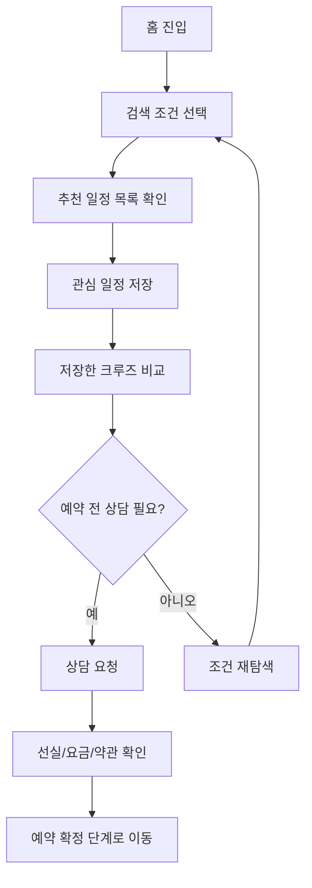

# BlueWave Trips 크루즈 웹앱 정의서

## 1. 프로젝트 개요

- 목적: 20-30대 대한민국 남녀가 단거리 크루즈 여행 일정을 탐색하고, 상품을 저장해 비교한 뒤 상담으로 이어지도록 한다.
- 핵심 컨셉: 가까운 출발항에서 시작하는 젊은 크루즈 예약 탐색 플랫폼.
- 화면 원칙: 웹 페이지에는 상품 탐색과 예약 UX만 노출하고, 요구사항/정책/IA/FLOW/화면설계/벤치마킹은 문서로만 관리한다.

## 2. 벤치마킹

| 사이트 | 참고한 UI/UX 포인트 |
|---|---|
| https://cruisetmk.kr/ | 예약하기, 혜택, 크루즈선사, 고객센터, 예약조회, 마이페이지 중심의 메뉴 구조. 실시간 일정, 선실, 프로모션 요금 탐색 포지션. |
| https://www.cruisecity.kr/ | 기획전/이벤트, 공지사항, 고객센터 전화번호, 상담하기 등 국내 여행사형 신뢰 요소. |
| https://www.cruisia.co.kr/ | 글로벌 크루즈를 국내 결제 환경에서 예약한다는 포지션, 항공권처럼 일정과 지역을 검색하는 구조. |
| https://www.cruisedirect.com/ | 목적지, 출발항, 월, 기간, 선사 중심 검색폼, 저장한 크루즈, 고객센터, 그룹 여행, 딜 카드, 선사/목적지 큐레이션. |

## 3. 요구사항 정의서

| ID | 요구사항 | 상세 |
|---|---|---|
| FR-01 | 크루즈 통합 검색 | 목적지, 출발항, 출발월, 기간, 선사 기준으로 일정을 검색한다. |
| FR-02 | 테마 필터 | 파티, 야경, 쇼핑, 혼행, 온천 등 20-30대 관심 테마로 필터링한다. |
| FR-03 | 저장/비교 | 최대 3개 크루즈를 저장하고 가격, 선사, 일정, 혜택, 추천 대상을 비교한다. |
| FR-04 | 기획전 노출 | 시크릿 딜, 원화 결제, 그룹 문의 같은 예약 전환형 혜택을 보여준다. |
| FR-05 | 목적지 바로가기 | 일본, 제주, 동남아, 부산 출발, 인천 출발 버튼으로 목록 조건을 즉시 변경한다. |
| FR-06 | 상담 CTA | 상담 요청 폼을 통해 희망 출발월과 인원을 입력할 수 있다. |
| FR-07 | 반응형 UI | 모바일에서는 검색폼과 상품 카드가 1열로 재배치되고 저장 비교 바가 유지된다. |
| FR-08 | 크루즈 챗봇 | 크루즈 준비물, 가격, 취소/변경, 주류/파티, 혼행/커플 등 질문에 답하고 조건 기반 상품을 추천한다. |
| FR-09 | OpenAI API 연동 | 브라우저에서 직접 API 키를 쓰지 않고 `POST /api/chat` 서버 프록시를 통해 OpenAI Responses API를 호출한다. |

### 챗봇 API 구조

```
브라우저 챗봇 UI
└─ POST /api/chat
   └─ server.mjs
      └─ OpenAI Responses API
```

- API 키는 `OPENAI_API_KEY` 환경변수로만 관리한다.
- 기본 모델은 `OPENAI_MODEL` 환경변수로 교체할 수 있으며, 기본값은 `gpt-5`다.
- API 키가 없거나 호출이 실패하면 프론트엔드의 로컬 규칙 기반 추천 답변으로 폴백한다.
- 실행 예시: `npm start` 또는 `node server.mjs`

## 4. 정책 정의서

| 정책 | 정의 |
|---|---|
| 가격 표기 | 모든 상품가는 1인 시작가로 표기하며, 항만세, 유류할증료, 선실 등급에 따라 달라질 수 있음을 안내한다. |
| 연령/주류 | 파티 및 주류 포함 상품은 신분증 확인, 탑승 가능 연령, 선내 안전수칙을 예약 전 확인한다. |
| 취소/변경 | 취소 수수료와 변경 가능 여부는 출항일 및 선사 약관에 따라 달라진다. |
| 상담 정보 | 상담 신청 시 희망 출발월, 인원, 연락처 등 최소 정보만 수집하는 흐름으로 확장한다. |
| 비교 기준 | 가격, 선사, 일정, 출발/목적지, 주요 혜택, 추천 대상, 분위기를 기본 비교 항목으로 한다. |

## 5. IA 정의서

```
홈
├─ 상단 유틸 메뉴
│  ├─ 기획전/이벤트
│  ├─ 고객센터
│  ├─ 저장한 크루즈
│  └─ 예약조회
├─ 메인 내비게이션
│  ├─ 예약하기
│  ├─ 혜택
│  ├─ 목적지
│  ├─ 크루즈선사
│  ├─ 추천일정
│  └─ 고객센터
├─ 히어로 검색
├─ 기획전/혜택
├─ 목적지 바로가기
├─ 선사 목록
├─ 추천 일정 목록
├─ 저장한 크루즈 비교
├─ 고객센터 안내
├─ 상담 요청
└─ 챗봇 상담
```

## 6. 서비스 FLOW



## 7. 화면설계도

### Desktop

```
┌──────────────────────────────────────────────┐
│ 유틸: 이벤트 고객센터 저장한크루즈 예약조회 │
├──────────────────────────────────────────────┤
│ Logo 예약하기 혜택 목적지 선사 추천 고객센터 │
├──────────────────────────────────────────────┤
│ Hero + 목적지/출발항/월/기간/선사 검색폼     │
├──────────────────────────────────────────────┤
│ 신뢰 지표 3개                                │
├──────────────────────────────────────────────┤
│ 기획전 카드                                  │
├──────────────────────────────────────────────┤
│ 목적지 바로가기 / 선사 레일                  │
├──────────────────────────────────────────────┤
│ 좌측 테마 필터 + 우측 상품 카드 2열          │
├──────────────────────────────────────────────┤
│ 저장한 크루즈 비교 테이블                    │
├──────────────────────────────────────────────┤
│ 고객센터 안내 + 상담 요청                    │
└──────────────────────────────────────────────┘
```

### Mobile

```
┌────────────────────┐
│ Logo        상담   │
├────────────────────┤
│ Hero               │
│ 검색폼 1열          │
├────────────────────┤
│ 기획전 카드         │
│ 목적지 버튼         │
│ 선사 목록           │
│ 테마 칩             │
│ 상품 카드 1열       │
│ 저장 비교 바        │
└────────────────────┘
```
