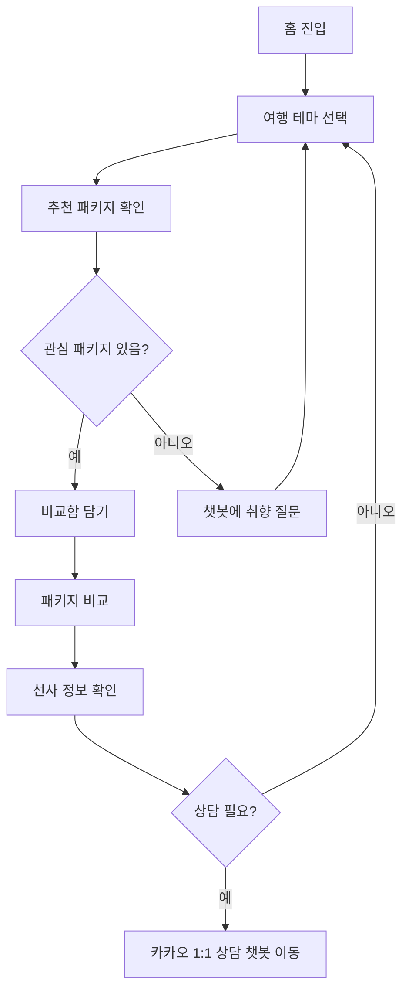

# BlueWave Trips 테마형 크루즈 웹앱 정의서

## 1. 프로젝트 개요

- 페르소나: 20-30대 대한민국 남녀 중 크루즈 여행에 관심이 있지만 아직 경험이 적은 사용자.
- 홈페이지 목적: 목적지 중심 검색이 아니라 크루즈 여행 테마별 탐색, 추천, 비교, 선사 정보 안내를 제공한다.
- 제외 범위: 예약하기, 예약조회 기능은 제공하지 않는다.
- 상담 연결: 1:1 상담은 카카오 1:1 상담 챗봇 링크로 연결한다.
- 톤앤매너: 밝고 시원한 바다 느낌, 깔끔하고 정돈된 카드형 UI.

## 2. 벤치마킹 요약

| 사이트 | 참고 포인트 |
|---|---|
| CRUSIA | 글로벌 크루즈 예약 플랫폼처럼 선사/상품 정보를 정돈된 카드로 안내하는 구조 |
| 크루즈시티 | 기획전, 고객센터, 카카오 상담 진입 등 국내 여행사형 신뢰 요소 |
| 크루즈TMK | 선사, 혜택, 고객센터 중심의 정보 탐색형 메뉴 구조 |
| CruiseDirect | 선사 정보, 고객지원, 저장/비교, 테마성 딜 카드와 비교 탐색 UX |

참고 URL:
- https://www.cruisia.co.kr/
- https://www.cruisecity.kr/
- https://cruisetmk.kr/
- https://www.cruisedirect.com/

## 3. 요구사항 정의서

| ID | 요구사항 | 상세 |
|---|---|---|
| FR-01 | 테마별 탐색 | 파티, 소셜, 쇼핑, 온천, 액티비티 등 테마 카드로 패키지를 탐색한다. |
| FR-02 | 추천 패키지 노출 | 선택한 테마에 맞는 단거리 크루즈 패키지를 카드 목록으로 보여준다. |
| FR-03 | 패키지 비교 | 최대 3개 패키지를 비교함에 담아 가격, 일정, 선사, 즐길거리, 추천 대상을 비교한다. |
| FR-04 | 선사 정보 안내 | 주요 크루즈 선사의 분위기, 강점, 추천 여행 스타일을 안내한다. |
| FR-05 | 챗봇 추천 | 사용자의 질문을 키워드 기반으로 분석해 테마와 패키지를 추천한다. |
| FR-06 | 카카오 상담 연결 | 예약 CTA 대신 카카오 1:1 상담 챗봇 링크로 연결한다. |
| FR-07 | 반응형 UI | 모바일에서는 테마, 카드, 비교, 챗봇이 1열 중심으로 자연스럽게 재배치된다. |
| FR-08 | 예약 기능 제외 | 예약하기, 결제, 예약조회, 계정 기능은 제공하지 않는다. |

## 4. 정책 정의서

| 정책 | 정의 |
|---|---|
| 가격 표기 | 모든 가격은 1인 시작가 예시로 표기하며 확정가는 상담 단계에서 확인한다. |
| 상담 연결 | 상담은 페이지 내 예약 양식이 아니라 카카오 1:1 상담 챗봇 외부 링크로 연결한다. |
| 연령/주류 | 파티 및 주류 포함 상품은 탑승 가능 연령과 신분증 확인이 필요할 수 있음을 안내한다. |
| 비교 기준 | 가격, 테마, 선사, 일정/노선, 즐길거리, 추천 대상을 기본 비교 항목으로 한다. |
| 데이터 성격 | 패키지와 가격은 UX 시연용 예시 데이터이며 실제 판매 전 약관과 가능 여부를 확인해야 한다. |
| 개인정보 | 페이지 내 개인정보 입력 기능은 두지 않고 외부 상담 채널에서 처리한다. |

## 5. IA 정의서

```
홈
├─ 상단 정보 메뉴
│  ├─ 테마 탐색
│  ├─ 비교함
│  ├─ 선사 정보
│  └─ FAQ
├─ 메인 내비게이션
│  ├─ 테마별 추천
│  ├─ 패키지 비교
│  ├─ 선내 즐길거리
│  ├─ 크루즈 선사
│  └─ 챗봇 추천
├─ 히어로
├─ 서비스 특징
├─ 테마 카드
├─ 추천 패키지 목록
├─ 비교 테이블
├─ 선내 즐길거리
├─ 선사 정보
├─ FAQ
├─ 카카오 상담 CTA
└─ 추천 챗봇
```

## 6. 서비스 FLOW



## 7. 화면설계도

### Desktop

```
┌──────────────────────────────────────────────┐
│ 테마 탐색 | 비교함 | 선사 정보 | FAQ         │
├──────────────────────────────────────────────┤
│ Logo  테마별 추천 패키지비교 즐길거리 선사  │
├──────────────────────────────────────────────┤
│ Hero: 목적지보다 분위기로 고르는 크루즈      │
├──────────────────────────────────────────────┤
│ 특징 3개                                      │
├──────────────────────────────────────────────┤
│ 테마 카드 6개                                 │
├──────────────────────────────────────────────┤
│ 추천 패키지 카드 3열                          │
├──────────────────────────────────────────────┤
│ 비교 테이블                                   │
├──────────────────────────────────────────────┤
│ 선내 즐길거리 / 선사 정보 / FAQ / 카카오 CTA │
└──────────────────────────────────────────────┘
```

### Mobile

```
┌────────────────────┐
│ Logo   카카오상담  │
├────────────────────┤
│ Hero               │
│ 테마 카드 1열      │
│ 패키지 카드 1열    │
│ 비교함             │
│ 선사 정보 카드     │
│ 추천 챗봇 플로팅   │
└────────────────────┘
```

